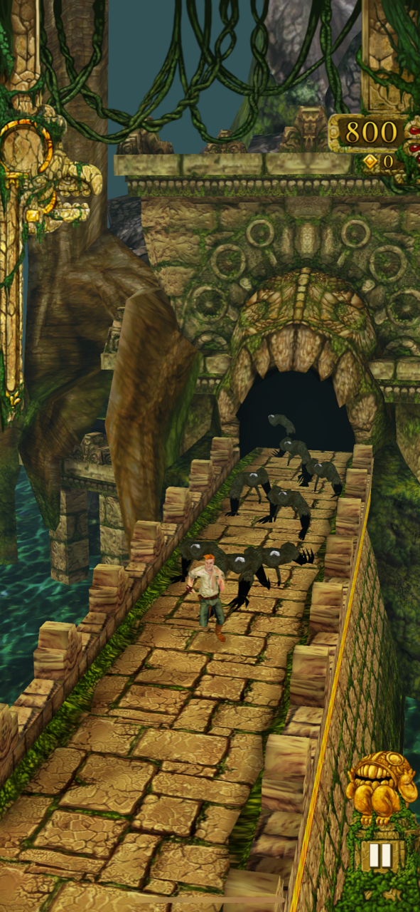
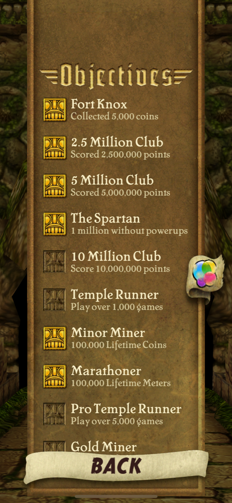
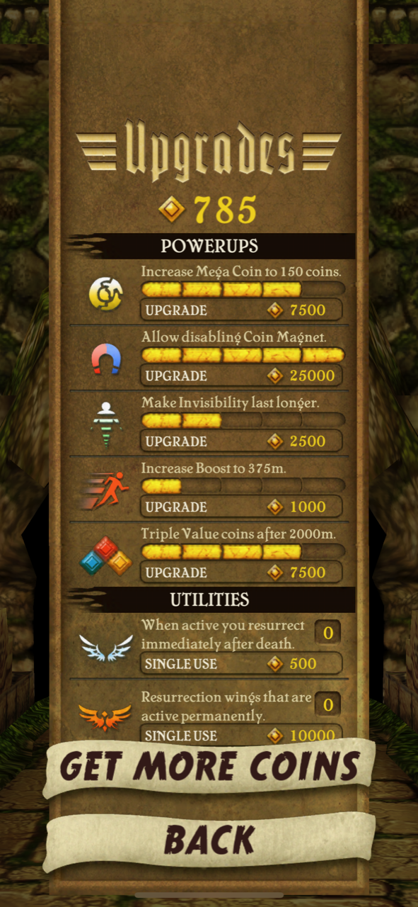
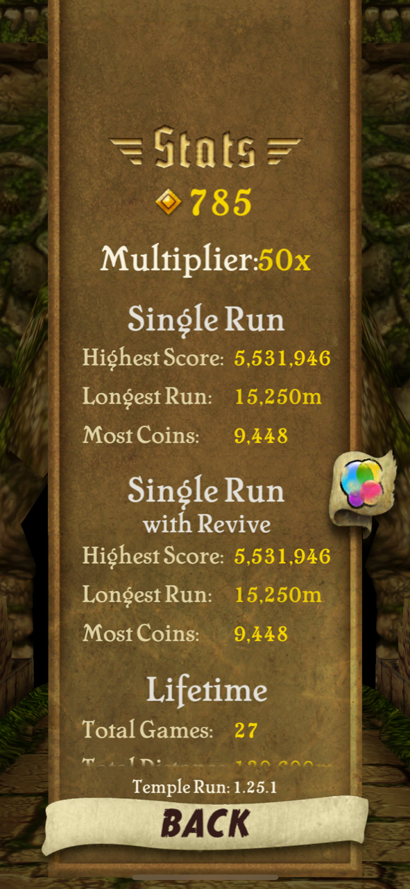

## Introduction

When we play a game, we often work towards winning the game. This is true in multiplayer games, where players may try to outperform each other, and in singleplayer games, where many games have a finite length and a clear objective. However, some of the most popular video games of all time do not follow this pattern. One such example is *Temple Run* (2011) by Imangi Studios. In *Temple Run*, the player controls an explorer who has stolen a cursed idol from a temple. During the game, the player must avoid obstacles as they run from pursuing Demon Monkeys through the temple's endless paths (Temple Run - Imangi, n.d.). Notably, *Temple Run* has no finish line; the game ends only when the player's avatar dies (Temple Run, 2011). Despite the lack of an end goal, games like *Temple Run* have achieved massive commercial success and global popularity. Other examples of popular games with no winning condition include *Minecraft* (2011) and *Tetris* (1985). This suggests that **winning games is less important than playing games to many gamers**. The first factor that contributes to this tendency is the inclusion of secondary objectives in endless games. These give players goals to work toward that may be entirely unrelated to winning the game. The second factor is player-driven objectives and skill progression. These are motivations which are defined by the players themselves and which are not associated with an in-game reward. The third factor is enjoyment of gameplay and escapism. Many people play games not to meet goals, but simply to experience the game.

> {:height="512px"}

> Figure 1: The start of a new game in Temple Run.

## Secondary Objectives

A secondary objective in a game is goal for which the game offers some kind of reward to the player upon completion. Secondary objectives can include collectible items such as coins, unlockable badges such as achievements, and more (Waszkiewicz & Kominiarczuk, 2021). Completing secondary objectives is natural and rewarding for many players, making them a significant part of why we play and enjoy games. *Temple Run* includes three types of secondary objectives: coins, which the player can collect as they run; objectives, which are landmarks of achievement for which the player receives a reward; and shop items, which are purchased with in-game coins. The specific design of secondary objectives also has an impact on the enjoyability of a game; secondary objectives that are well aligned with the primary objective of the game lead to higher play times than those that require the player to take unnecessarily complex game actions (Andersen et al., 2011). That is, secondary objectives that the player can achieve *while also achieving the primary objectives* are more engaging for players. *Temple Run*'s secondary objectives align with this principle.

Coins in *Temple Run* appear along the main path of the game and are collected when the player's avatar runs into them. Coins can appear on the left or right sides of the path as well as in the middle, requiring the player to tilt their device to collect them all. Collecting coins is an easy and intuitive secondary objective in *Temple Run*, lending additional depth to the gameplay without making it more challenging. The player is also rewarded with bonus points for each coin collected, increasing the player's final score. Since coins can be collected by the player without departing from the main path and without distracting from the goal of running as far as possible, they correlate well to the findings of Andersen et al. (2011).

The second type of secondary objective in *Temple Run* is what are simply known as *objectives* in the game. Objectives in *Temple Run* are individual goals the player can achieve, each one granting an increase to the player's *score multiplier* when it is successfully completed. Secondary objectives of this type are commonly called *achievements* in other games. When a player completes an objective in *Temple Run*, their *score multiplier* increases by one point, increasing that player's score in all subsequent runs. Examples of objectives in *Temple Run* include "*Athlete* - Ran 2,500 meters" and "*Fort Knox* - Collected 5,000 coins". Much like collecting coins, most objectives are aligned with the the main goal of the game and can be completed by taking intuitive actions. There are only 3 objectives that reward the player for taking actions they would normally avoid doing; these are "*Miser Run* - 500m collecting no coins", "*Allergic to Gold* - 1,000m collecting no coins", and "*The Spartan* - 1 million without powerups". Since the game includes dozens of objectives of varying difficulty, players are unlikely to complete them all before becoming bored of the game. Completing secondary objectives grants the player a sense of satisfaction and provides them with additional motivation to play the game. Failing to complete an objective, especially by a narrow margin, can also motivate players (Wadhwa & Kim, 2015).

The final type of secondary objective in *Temple Run* is the in-game shop. Coins collected by the player can later be spent to purchase permanent upgrades, single-use items, and cosmetic items. The non-cosmetic items available in the shop increase the score a player can achieve in the game, either by helping the player to run farther or enabling the player to collect more coins. For example, when the player purchases the *Coin Magnet* upgrade and collects it during a game, it will allow them to collect nearby coins without needing to run into them. In this way, shop items are aligned with the game's primary goal in two ways: they require the player to collect coins to purchase them, reinforcing the motivation to do so; and they help the player to achieve a higher score, reinforcing the importance of that goal.

> {:height="512px"}

> Figure 2: Part of the list of objectives in Temple Run.

> {:height="512px"}

> Figure 3: Some of the powerups a player can purchase in the game.

## Player-driven Objectives

While gaming, many players set personal goals for themselves that have no reward or recognition within the game itself. Indeed, the goal of winning a game can be seen as a player-driven objective itself because, in general, the game cannot offer any meaningful in-game reward after the player has already won. Another common player-driven goal is one of exploration and adventure; in this way, survival games like *Minecraft* are very different from endless games such as *Temple Run* and *Tetris* even though they all have no winning condition (Lobo, 2019). In *Temple Run* and other endless games, this implicit objective is not present. Instead, players intuitively try to achieve the highest possible score in the game. This is driven by two main motivators: the desire to improve one's skill in the game, and the desire to attain a higher rank compared to others in the game (Medler, 2011; Velez et al., 2018).

Accomplishment in video games is often represented as a *score*, a single number that indicates how well a player has played the game. Larger numbers represent better performance, and the highest score a player has ever achieved is their *high score*. Beating one's high score (replacing it with a higher score) is one of the most common types of player-driven objectives in games, and *Temple Run* is no different. Each time a player plays *Temple Run* (or "runs"), the game calculates a score for that run based on the distance the player has traveled and the number of coins they have collected during that run. The score is updated continuosly as the player runs, making it easy to monitor one's performance while playing. The player's score is also shown at the end of each run and can no longer be modified. Displaying the player's score consistently and in multiple places reinforces its importance to the core gameplay and proposes the objective of achieving the highest score possible.

By trying to achieve a high score in an endless game, players may also be comparing their performance to others and attempting to elevate their rank (Velez et al., 2018). This type of social behaviour is a player-driven objective to improve one's skill at the game relative to other players, including both friends and strangers. *Temple Run* takes advantage of this form of motivation by integrating the game's scoring system with the iOS Game Center system, allowing players to compare their scores with those of players around the world. By giving a way for players to compare their scores to others, a leaderboard encourages players to spend more time improving their skill in the game. To augment the leaderboard system, the integration with Game Center also allows players to "friend" other players. In *Temple Run*, the high scores of a player's friends are shown in the game world as arches over the game's path, providing a clear visual indicator when a player passes a friend's highest score. This increases the investment a player has in their high score, since they can directly compare it to their friends and can create player-driven goals based on that social interaction.

> {:height="512px"}

> Figure 4: Displaying in-game statistics encourages players to focus on them.

## Enjoyment of Gameplay

Possibly the most obvious reason we play games is because it is an enjoyable and distracting activity. Similar to other forms of media like books and television, games allow us to enter a virtual world different from our own, providing a source of entertainment and escapism (Larche & Dixon, 2021; Lin & Lin 2011). Different people experience entertainment differently and enjoyment of a game varies between different audiences. As a free mobile game, *Temple Run* is played by a very wide audience and has been downloaded more than 1 billion times (Mlot, 2014). In order to appeal to such a large audience, *Temple Run* applies two main principles: players' enjoyment of intense focus, and desire to play again after a "near win".

A player's focus and presence in a game, as well as their connection to their avatar, is an important factor in that player's enjoyment of the game (Luo et al., 2019). In *Temple Run*, the player is invited to connect with their avatar through the third-person camera view that follows it through the game. Since both the visual display and the sounds in the game world correspond to the avatar's movement, the player can easily associate their own senses with the space of the game (Ausburn et al., 2019). This immersion enables the player to focus more strongly on the game and leads to a greater investment in the avatar's success, in turn leading to increased play time and greater enjoyment.

Another factor that motivates players to play more is the effect of the "near win". A near win refers to the situation that arises when a player fails a task they think they are close to accomplishing (Wadhwa & Kim, 2015). When a player feels that they have had a near win, they will gain additional motivation to try again. In games with a clear winning condition, this has a straightforward interpretation; however, in *Temple Run* and other endless games, a near win sensation occurs under different circumstances. The most obvious alternative to the near win is the near completion of a secondary objective. Examples of near completions of secondary objectives in *Temple Run* include running almost far enough to reach an objective and collecting almost enough coins to purchase a desirable upgrade. Players may also experience near wins with respect to player-driven objectives, such as nearly beating a friend's high score or nearly beating one's own high score. Since these situations motivate players to keep playing through a feeling of frustration, they might also decrease overall player enjoyment of the game (Larche et al., 2017). This can have a negative impact on the player (Chamarro et al., 2020), which may in turn lead to a negative perception of the game and reduced play in the long term. However, it is not clear that this outweighs the increased play time this effect causes.

## Conclusion

As an endless runner game in which the main goal is simply to run as far as possible before failing, every game of *Temple Run* ends in the player character's death. While this may seem like an unfulfilling style of gameplay, the three factors of secondary objectives, player-driven objectives, and enjoyment of gameplay have made the game popular nonetheless. Firstly, the game includes three types of secondary objectives: collectible coins, objectives (also known as achievements), and an in-game shop. Each type of secondary objective aligns with the main goal of the game in a different way (Andersen et al., 2011). The coins can be collected without deviating from the main path of the game and give the player additional points when they are collected. The objectives are awarded to players based on significant accomplishment along the same metrics as the main goal (Waszkiewicz & Kominiarczuk, 2021). The non-cosmetic shop items all help the player run farther and collect more coins. The game also encourages players to define their own personal objectives by showing the player's current score as well as their high score in many places of the game's user interface, and also by allowing players to see their rank on either a global leaderboad or a friends-only leaderboard (Velez et al., 2018). Finally, the game takes advantage of "near win" psychology to keep players engaged in the game despite frustrations and annoyances (Larche et al., 2017; Wadhwa & Kim, 2015). By providing explanation for reasons people play games other than to win, these three factors explain how the *Temple Run* series (including both the original game and the sequel, *Temple Run 2*) was able to garner over a billion downloads within only three years of its release (Mlot, 2014).

## References

Andersen, E., Liu, Y.-E., Snider, R., Szeto, R., Cooper, S., & Popović, Z. (2011). On the harmfulness of secondary game objectives. *Proceedings of the 6th International Conference on Foundations of Digital Games*, 30-37. https://doi.org/10.1145/2159365.2159370

Ausburn, L. J., Martens, J., Baukal, Jr, Charles E., Agnew, I., Dionne, R., & Ausburn, F. B. (2019). User Characteristics, Trait vs. State Immersion, and Presence in a First-Person Virtual World. *Journal of Virtual Worlds Research, 12*(3). https://doi.org/10.4101/jvwr.v12i3.7366

Chamarro, A., Oberst, U., Cladellas, R., & Fuster, H. (2020). Effect of the Frustration of Psychological Needs on Addictive Behaviors in Mobile Videogamers - The Mediating Role of Use Expectancies and Time Spent Gaming. *International Journal of Environmental Research and Public Health, 17*(17), 6429. https://doi.org/10.3390/ijerph17176429

Larche, C. J., & Dixon, M. J. (2021). Winning isn't everything: The impact of optimally challenging smartphone games on flow, game preference and individuals gaming to escape aversive bored states. *Computers in Human Behavior, 123*, 106857. https://doi.org/10.1016/j.chb.2021.106857

Larche, C. J., Musielak, N., & Dixon, M. J. (2017). The Candy Crush Sweet Tooth: How 'Near-misses' in Candy Crush Increase Frustration, and the Urge to Continue Gameplay. *Journal of Gambling Studies, 33*(2), 599-615. https://doi.org/10.1007/s10899-016-9633-7

Lin, Y.-L., & Lin, H.-W. (2011). A study on the goal value for massively multiplayer online role-playing games players. *Computers in Human Behavior, 27*(6), 2153-2160. https://doi.org/10.1016/j.chb.2011.06.009

Lobo, P. (2019). Novel Subjects: Robinson Crusoe & Minecraft and the Production of Sovereign Selfhood. *Game Studies, 19*(1). https://gamestudies.org/1901/articles/lobo

Luo, Z., Westerman, D., & Banks, J. (2019). Extending the self: Player-avatar relations and presence among U.S. and Chinese gamers. *Journal of Virtual Worlds Research, 12*(3). https://doi.org/10.4101/jvwr.v12i3.7395

Medler, B. (2011). Player Dossiers: Analyzing Gameplay Data as a Reward. *Game Studies, 11*(1). https://gamestudies.org/1101/articles/medler

Mlot, S. (2014, June 4). Temple Run Hits a Milestone 1B Downloads. *PCMag*. https://www.pcmag.com/news/temple-run-hits-a-milestone-1b-downloads

Temple Run (iOS version) [Video Game]. (2011). Imangi Studios.

Temple Run - Imangi. (n.d.). Imangi Studios. Retrieved April 16, 2024, from https://imangistudios.com/thegames/temple-run/

Velez, J. A., Ewoldsen, D. R., Hanus, M. D., Song, H., & Villarreal, J. A. (2018). Social Comparisons and Need Fulfillment: Interpreting Video Game Enjoyment in the Context of Leaderboards. *Communication Research Reports, 35*(5), 424-433. https://doi.org/10.1080/08824096.2018.1525352

Wadhwa, M., & Kim, J. C. (2015). Can a Near Win Kindle Motivation? The Impact of Nearly Winning on Motivation for Unrelated Rewards. *Psychological Science, 26*(6), 701-708. https://doi.org/10.1177/0956797614568681

Waszkiewicz, A., & Kominiarczuk M. (2021). Towards a Model of Objective-Based Reward Systems. *Game Studies, 21*(1). https://gamestudies.org/2101/articles/waszkiewicz_kominiarczuk
