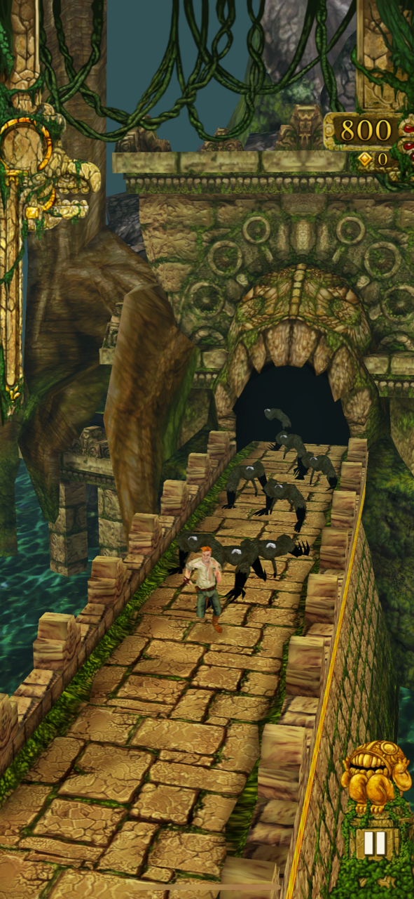
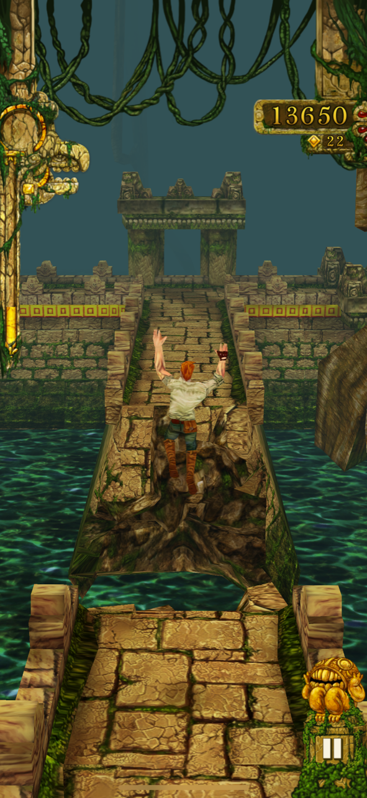

## Introduction

When we play a game, we often work towards winning the game. This is true in multiplayer games, where players may try to outperform each other, and in singleplayer games, where many games have a finite length and a clear objective. However, some of the most popular video games of all time do not follow this pattern. One such example is *Temple Run* (2011) by Imangi Studios. In *Temple Run*, the player controls an explorer who has stolen an idol from a temple. During the game, the player must avoid obstacles as they run from pursuing demon monkeys through the temple's endless paths. Notably, *Temple Run* has no finish line - the game ends when the player's avatar dies. Despite the lack of an end goal, games such as *Temple Run*, *Minecraft*, and *Tetris* have achieved massive commercial success and global popularity. This suggests that **winning games is less important than playing games to many gamers**. The first factor that contributes to this tendency is the inclusion of secondary objectives, often called achievements, in endless games. These give players goals to work toward that may be entirely unrelated to winning the game. The second factor is player-driven objectives and skill progression. These are motivations defined by the player themself and have no in-game reward. The third factor is enjoyment of gameplay and escapism. Many people play games not to complete objectives, but simply to experience the game. Together, these three factors explain why winning a game is not the only reason people play.

## Secondary Objectives

The inclusion of secondary objectives in *Temple Run* offers players a set of goals they can work towards, each one granting an increase to the player's score multiplier when it is successfully completed. A secondary objective is a specific in-game task that, when completed by a player, grants that player some kind of reward or badge. For example, when a player completes an objective in *Temple Run*, their *score multiplier* increases by one point, increasing that player's score in all subsequent runs. Examples of objectives in *Temple Run* include "*Athlete* - Ran 2,500 meters" and "*Fort Knox* - Collected 5,000 coins". Since the game includes dozens of objectives of varying difficulty, players are unlikely to complete them all before becoming bored of the game. Completing secondary objectives grants the player a sense of satisfaction and provides them with additional motivation to play the game. The feeling of completing an objective is similar to that of winning the game, and so can replace the need for a game to have a definitive conclusion.

The specific design of secondary objectives also has an impact on the enjoyability of a game. Secondary objectives that are well aligned with the primary objective in the game are more enjoyable than those that require the player to take unnecessarily complex game actions (Andersen, 2011). That is, secondary objectives that the player can achieve *while also achieving the primary objectives* are more engaging for players. *Temple Run*'s secondary objectives align with this principle - most of the secondary objectives in the game reward the player for reaching a high score, collecting coins, or spending coins in the in-game store. There are only 3 objectives that reward the player for taking actions they would normally avoid doing - these are "*Miser Run* - 500m collecting no coins", "*Allergic to Gold* - 1,000m collecting no coins", and "*The Spartan* - 1 million without powerups".

## Player-driven Objectives

This is the second argument.

## Enjoyment of Gameplay

This is the third argument.

## Conclusion

This is the conclusion.

## References

Andersen, E., Liu, Y.-E., Snider, R., Szeto, R., Cooper, S., & Popović, Z. (2011). On the harmfulness of secondary game objectives. *Proceedings of the 6th International Conference on Foundations of Digital Games*, 30–37. https://doi.org/10.1145/2159365.2159370

Larche, C. J., & Dixon, M. J. (2021). Winning isn't everything: The impact of optimally challenging smartphone games on flow, game preference and individuals gaming to escape aversive bored states. *Computers in Human Behavior, 123*, 106857. https://doi.org/10.1016/j.chb.2021.106857
